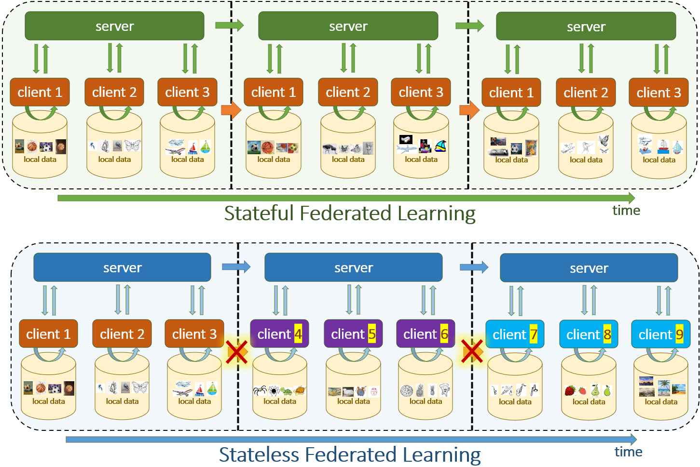

## FedFOR: Stateless Heterogeneous Federated Learning with First-Order Regularization
TO BE RELEASED PyTorch code for the preprint:\
**FedFOR: Stateless Heterogeneous Federated Learning with First-Order Regularization**\
[Junjiao Tian], [James Seale Smith], [Zsolt Kira]\
[[arXiv]]

## Abstract
Federated Learning (FL) seeks to distribute model training across local clients without collecting data in a centralized data-center, hence removing data-privacy concerns. A major challenge for FL is data heterogeneity (where each client's data distribution can differ) as it can lead to weight divergence among local clients and slow global convergence. The current SOTA FL methods designed for data heterogeneity typically impose regularization to limit the impact of non-IID data and are stateful algorithms, i.e., they maintain local statistics over time. While effective, these approaches can only be used for a special case of FL involving only a small number of reliable clients. For the more typical applications of FL where the number of clients is large (e.g., edge-device and mobile applications), these methods cannot be applied, motivating the need for a stateless approach to heterogeneous FL which can be used for any number of clients. We derive a first-order gradient regularization to penalize inconsistent local updates due to local data heterogeneity. Specifically, to mitigate weight divergence, we introduce a first-order approximation of the global data distribution into local objectives, which intuitively penalizes updates in the opposite direction of the global update. The end result is a stateless FL algorithm that achieves 1) significantly faster convergence (i.e., fewer communication rounds) and 2) higher overall converged performance than SOTA methods under non-IID data distribution. Importantly, our approach does not impose unrealistic limits on the client size, enabling learning from a large number of clients as is typical in most FL applications.

[Junjiao Tian]: https://potatotian.github.io/
[James Seale Smith]: https://jamessealesmith.github.io/
[Zsolt Kira]: https://www.cc.gatech.edu/~zk15/
[arXiv]: https://arxiv.org/
